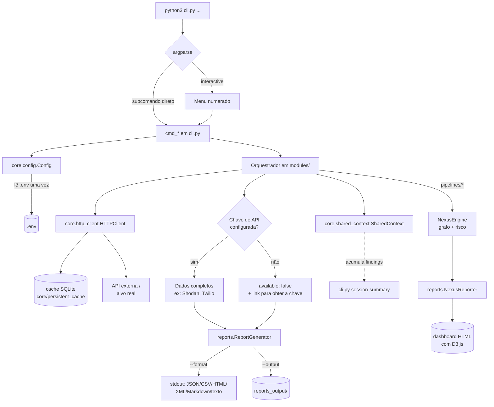

# Mão de Deus UNIFIED

Ferramenta de OSINT e pentest numa arquitetura modular única: OSINT
profundo + recon passivo/ativo + pentest + toolkit de sistema/rede/cripto +
correlação de inteligência (NEXUS) + relatórios multi-formato + CLI
unificada com menu interativo.

---
[](CHANGELOG.md)
[](https://www.python.org/)
[](#requisitos)
[](LICENSE)
[](#testes)

---

## Índice

- [Visão Geral](#visão-geral)
- [Recursos](#recursos)
- [Requisitos](#requisitos)
- [Instalação](#instalação)
- [Dependências](#dependências)
  - [Obrigatórias](#obrigatórias)
  - [Opcionais (chaves de API)](#opcionais-chaves-de-api)
- [Início Rápido](#início-rápido)
- [Modo Interativo](#modo-interativo)
- [Referência de Comandos](#referência-de-comandos)
  - [OSINT](#osint)
  - [Reconhecimento](#reconhecimento)
  - [Scanner de Vulnerabilidades](#scanner-de-vulnerabilidades)
  - [Toolkit — Sistema, Rede, Segurança, Criptografia](#toolkit--sistema-rede-segurança-criptografia)
  - [Pipelines de Pentest](#pipelines-de-pentest)
- [Motor NEXUS](#motor-nexus)
- [Threat Intelligence](#threat-intelligence)
- [Formatos de Saída](#formatos-de-saída)
- [Monitorização Contínua](#monitorização-contínua)
- [Exemplos Práticos](#exemplos-práticos)
- [Arquitetura](#arquitetura)
- [Diferença entre as camadas do código](#diferença-entre-as-camadas-do-código)
- [Aviso Legal](#aviso-legal)
- [Testes](#testes)
- [Contribuindo](#contribuindo)
- [Licença](#licença)
- [Contato](#contato)

---

## Visão Geral

A Mão de Deus UNIFIED é uma **ferramenta de linha de comando** para OSINT
(*Open Source Intelligence*) e pentest, pensada para correr localmente sem
nenhuma infraestrutura própria — sem servidor, sem base de dados
obrigatória, sem custo de hospedagem. Tudo o que precisares está num
`venv` local: `python3 cli.py <comando>`.

---

## Recursos

- **8 orquestradores OSINT** por tipo de alvo: domínio, email, IP, telefone,
  pessoa, empresa, imagem, dark web.
- **Reconhecimento passivo e ativo**: WHOIS real, DNS, SSL, subdomínios,
  port scan, scan de range CIDR, fingerprint de tecnologia.
- **50+ integrações de OSINT avulso**: username search (18 plataformas),
  password breach check (HIBP k-anonymity), CVE lookup (NVD), ASN/BGP
  lookup, deteção de nó Tor, Wayback Machine, Google Dorks, crawler
  passivo, análise de cabeçalho de email, metadados de documentos
  (PDF/DOCX/XLSX/PPTX).
  
- **50+ scanners de vulnerabilidade ativa**: WAF, JWT, GraphQL (com depth
  limit/batching/over-fetching), IDOR, Clickjacking, Rate Limit, API Fuzzer,
  SSL, Robots/Sitemap, Vuln Scanner, Subdomain Takeover — mais headers de
  segurança, cookies, redirect HTTP→HTTPS, open redirect, directory
  listing, debug mode, credenciais padrão, path traversal, command
  injection, XXE, SSTI (com variante blind time-based), NoSQLi, LDAP
  injection, HTML injection, deserialização insegura, Zip Slip, upload sem
  restrição, mass assignment, probes seguros de ReDoS/XML bomb e cache
  headers, SSRF contra metadados de nuvem, OAuth (redirect_uri hijacking/
  state omission), enumeração de usuários via timing, Web Cache Deception,
  tabnabbing, serviços de gestão expostos (Docker/Kubernetes/CI-CD), HTTP
  Request Smuggling (CL.TE), deteção de HTTP/2, prototype pollution
  (heurística estática), SAML (metadata/SSO) e DOM Clobbering (via
  Playwright/Chromium).
- **Supply chain e IaC** (`cli.py deps`/`cli.py iac`): analisam
  `requirements.txt`/`package.json` e ficheiros Terraform/Ansible locais
  em busca de registries HTTP inseguros, typosquatting, dependency
  confusion, security groups/buckets abertos e storage sem encriptação.
- **Análise estática de APK** (`cli.py apk`): permissões perigosas,
  debuggable/allowBackup/cleartext, componentes exportados sem permissão,
  deep links, secrets hardcoded, indício de SSL pinning ausente, ausência
  de ofuscação e de FLAG_SECURE, StrandHogg, tapjacking, exposição de
  clipboard, uso de criptografia sem AndroidKeyStore (requer `androguard`).
- **Instrumentação dinâmica opt-in** (`cli.py apk-dynamic`, requer
  `--i-accept-risk`): anexa via Frida a uma app Android em execução num
  device/emulador autorizado — deteção de anti-instrumentação, superfície
  de bypass biométrico e de dynamic linker injection (requer `frida`,
  não instalado por padrão; use apenas em dispositivos próprios/autorizados).
- **Toolkit local**: criptografia (hash/encode/decode/uuid/rot13/césar),
  segurança de ficheiros (scan, permissões, gerador de password), rede
  (ping/traceroute/DNS/banner), sistema (specs/monitor/processos).
- **Motor NEXUS**: recon automático + grafo de correlação + score de risco
  0–100, com dashboard HTML interativo (D3.js).
- **Threat Intelligence**: Shodan, AbuseIPDB, VirusTotal, AlienVault OTX,
  feeds RSS de advisories (CISA, SANS ISC).
- **Pipelines de pentest** em 3 níveis: tradicional (passiva), agressiva
  (ativa + scanner), IA (secret scanning + NEXUS + exploração opt-in).
- **Monitorização contínua**: snapshot + diff entre execuções (`watch`).
- **6 formatos de saída**: JSON, CSV, HTML, XML, Markdown, texto.
- **Menu interativo** numerado, com banner e cores — não precisas de
  decorar sintaxe para explorar a ferramenta manualmente.
- **Degradação graciosa**: nenhuma chave de API é obrigatória — sem ela, a
  funcionalidade correspondente devolve um aviso claro em vez de falhar.

## Requisitos

- **Python 3.8 ou superior**
- **Sistema operativo**: Linux, macOS ou Windows — testado nos três.
- Ligação à internet para as funcionalidades que consultam fontes públicas
  (a maioria); o toolkit local (`cripto`, `seguranca`, `sistema`) funciona
  offline.

## Instalação

```bash
python3 -m venv venv
source venv/bin/activate          # Windows: venv\Scripts\activate
pip install -r requirements.txt
python3 cli.py --help
```

`pip install -r requirements.txt` instala limpo nos três sistemas — a única
dependência específica de plataforma (`win10toast`, Windows) está marcada
com `sys_platform == "win32"` e nunca é instalada nos outros.

## Dependências

### Obrigatórias

Instaladas sempre por `pip install -r requirements.txt`, necessárias para o
funcionamento base da ferramenta:

| Pacote | Usado para |
|---|---|
| `requests` | Todas as chamadas HTTP (via `core.http_client.HTTPClient`) |
| `dnspython` | Consultas DNS (`recon passive`, `recon active`) |
| `python-whois` | WHOIS real de domínios |
| `psutil` | `sistema info/monitor/processos` |
| `beautifulsoup4` | `crawl` (parsing de HTML) |
| `colorama` | Cores ANSI corretas no `cmd.exe`/PowerShell do Windows |
| `feedparser` | `recon rss-advisories` (feeds RSS) |
| `certifi` | Validação de certificados SSL (dependência do `requests`) |

### Opcionais (chaves de API)

**Nenhuma é obrigatória.** Sem a chave, o módulo correspondente devolve
`{"available": false, "hint": "..."}` em vez de falhar — o resto da
ferramenta continua 100% funcional.

```bash
cp .env.example .env
# edita o .env com as chaves que tiveres
```

| Variável | Pacote associado | Usada em | Desbloqueia | Grátis? |
|---|---|---|---|---|
| `SHODAN_API_KEY` | `shodan` | `recon threat-intel`, `osint ip` | Portas/serviços/banners/CVEs de um host | Trial grátis |
| `TWILIO_ACCOUNT_SID` + `TWILIO_AUTH_TOKEN` | `twilio` | `osint phone` | Nome do titular (EUA) + deteção de SIM swap | Trial grátis |
| `GEOIP_DB_PATH` | `geoip2` | `osint ip` | Geolocalização de IP offline (GeoLite2) | Grátis (registo MaxMind) |
| `ABUSEIPDB_API_KEY` | — (HTTP puro) | `recon threat-intel`, `osint ip` | Score de abuso de IP | Grátis (limite diário) |
| `VIRUSTOTAL_API_KEY` | — (HTTP puro) | `recon threat-intel` | Reputação de domínio/hash/URL | Grátis (limite/min) |
| `HIBP_API_KEY` | — (HTTP puro) | `recon password-check` (email) | Vazamentos reais por email | Paga |
| `HUNTER_API_KEY` | — (reservada) | — | Descoberta de emails corporativos (ainda não religado) | Trial grátis |

`phonenumbers` é obrigatória mas não pede chave nenhuma — dá carrier/tipo de
linha/timezone offline sempre, o Twilio só acrescenta o nome do titular.

O `.env` é carregado automaticamente por `core/config.py` (sem depender de
`python-dotenv`) e está no `.gitignore` — nunca vai parar ao repositório.

### Opcionais (dependências pesadas, degradam graciosamente)

Estas também não são obrigatórias para o resto da ferramenta funcionar —
sem elas, o comando correspondente devolve um erro tratado (`success:
false` + `error_message` explicando o que instalar) em vez de crashar.

| Pacote | Usado para | Instalação extra |
|---|---|---|
| `androguard` | `cli.py apk` (análise estática de APK) | Já em `requirements.txt` |
| `playwright` | `cli.py scanner domcloaking` (único scanner com motor JS real) | Já em `requirements.txt`, mas exige também `python -m playwright install chromium` |
| `frida` + `frida-tools` | `cli.py apk-dynamic` (instrumentação dinâmica, opt-in) | **Não** está em `requirements.txt` — instalar manualmente por conta e risco; exige device/emulador com `frida-server` a correr |

## Início Rápido

```bash
# OSINT de domínio, com recon ativa opcional
python3 cli.py osint domain example.com --deep

# Verificar se um telefone existe e o tipo de linha
python3 cli.py osint phone +5511987654321

# Menu interativo — mais fácil para começar a explorar
python3 cli.py interactive
```

## Modo Interativo

```bash
python3 cli.py interactive
```

Abre um menu numerado (banner ASCII, cores, fases separadas por tela limpa)
que cobre todos os comandos abaixo sem precisar de decorar sintaxe —
pensado para uso exploratório manual, ao contrário dos comandos diretos
(pensados para scripting/automação).

## Referência de Comandos

Qualquer comando aceita `--format {json,csv,html,xml,markdown,text}` e
`--output <nome>` para gravar o resultado em `reports_output/` além de
imprimir em stdout.

### OSINT

```bash
python3 cli.py osint domain example.com [--deep]
python3 cli.py osint email user@example.com
python3 cli.py osint ip 8.8.8.8 [--deep]                # + geo + Shodan + AbuseIPDB
python3 cli.py osint phone +5511987654321                # + carrier/risco/Twilio
python3 cli.py osint person "João Silva" --location "Porto"
python3 cli.py osint company "Empresa X" --country PT
python3 cli.py osint image https://exemplo.com/foto.jpg
python3 cli.py osint darkweb "termo de busca"

python3 cli.py taxid 111444777 --country PT --type NIF  # CPF/CNPJ/SSN/NIF/SIRET
```

### Reconhecimento

```bash
python3 cli.py recon passive example.com               # inclui WHOIS real
python3 cli.py recon active example.com
python3 cli.py recon threat-intel 1.2.3.4                # Shodan/AbuseIPDB/VT/OTX
python3 cli.py recon username-search johndoe              # 18 plataformas verificadas
python3 cli.py recon password-check "senha123"            # HIBP k-anonymity
python3 cli.py recon url-check https://exemplo.com         # anti-phishing
python3 cli.py recon paste-search "termo"
python3 cli.py recon rss-advisories                         # CISA + SANS ISC

python3 cli.py crawl https://exemplo.com                  # links/emails/forms
python3 cli.py cve openssh                                  # NVD
python3 cli.py asn 8.8.8.8                                   # ASN/BGP
python3 cli.py tor-check 1.2.3.4
python3 cli.py wayback exemplo.com
python3 cli.py dorks exemplo.com                             # Google Dorks
python3 cli.py hash-id 5d41402abc4b2a76b9719d911017c592
python3 cli.py email-header cabecalho.eml
python3 cli.py doc-meta documento.pdf
python3 cli.py cidr 192.168.1.0/24                           # port scan em range
python3 cli.py takeover example.com                          # subdomain takeover
```

### Scanner de Vulnerabilidades

```bash
python3 cli.py scanner waf example.com
python3 cli.py scanner jwt https://api.exemplo.com
python3 cli.py scanner vuln https://exemplo.com
# nomes disponíveis: apifuzzer, cache, cachedeception, clickjacking, cmdi,
#   cookies, debug, defaultcreds, deserialization, dirlisting, domcloaking,
#   exposedservices, graphql, headers, htmli, http2, idor, jwt, ldapi,
#   logintiming, massassignment, nosqli, oauth, openredirect, protopollution,
#   ratelimit, redos, robots, saml, smuggling, ssl, ssrf, ssti, tabnabbing,
#   tlsredirect, traversal, upload, vuln, waf, xmlbomb, xxe, zipslip
#
# Os scanners de injeção/upload/DoS-safe (cmdi, traversal, xxe, ssti,
# nosqli, ldapi, htmli, zipslip, upload, massassignment, redos, xmlbomb,
# defaultcreds, ssrf, oauth, logintiming, smuggling) enviam payloads reais
# — use apenas contra alvos que você tem autorização para testar (ex.:
# seus próprios projetos em localhost).
#
# domcloaking precisa de Playwright + Chromium instalados:
#   pip install playwright && python -m playwright install chromium

python3 cli.py apk /caminho/para/app.apk    # análise estática de APK

# Instrumentação dinâmica (Frida) — opt-in, por conta e risco do operador,
# exige device/emulador com frida-server e app já em execução:
#   pip install frida frida-tools
python3 cli.py apk-dynamic com.exemplo.app --i-accept-risk

# Supply chain e Infrastructure as Code — analisam ficheiros locais do
# projeto, não um alvo remoto
python3 cli.py deps /caminho/do/projeto     # requirements.txt/package.json
python3 cli.py iac /caminho/do/projeto      # Terraform/Ansible
```

### Toolkit — Sistema, Rede, Segurança, Criptografia

```bash
# Sistema
python3 cli.py sistema info                    # specs de CPU/RAM/disco/OS
python3 cli.py sistema monitor                  # amostra de uso de recursos
python3 cli.py sistema processos --limit 30       # top processos por CPU

# Rede
python3 cli.py rede ping exemplo.com
python3 cli.py rede traceroute exemplo.com
python3 cli.py rede dns exemplo.com
python3 cli.py rede banner exemplo.com --port 22

# Segurança local
python3 cli.py seguranca scan /caminho              # ficheiros suspeitos
python3 cli.py seguranca hash /caminho/ficheiro       # MD5 + SHA256
python3 cli.py seguranca permissoes /caminho/ficheiro
python3 cli.py seguranca senha --length 20             # gerador seguro

# Criptografia
python3 cli.py cripto hash "texto"
python3 cli.py cripto encode "texto" --scheme base64
python3 cli.py cripto decode "dGV4dG8=" --scheme base64
python3 cli.py cripto uuid
python3 cli.py cripto rot13 "texto"
python3 cli.py cripto caesar "texto" --shift 3
```

### Pipelines de Pentest

```bash
python3 cli.py pentest example.com --pipeline 1              # tradicional (passiva)
python3 cli.py pentest example.com --pipeline 2               # agressiva (ativa + scanner)
python3 cli.py pentest example.com --pipeline 3                # IA (secrets + NEXUS)
python3 cli.py pentest example.com --pipeline 3 --exploit        # + XSS/SQLi/SSRF ativos
python3 cli.py pentest example.com --pipeline all
```

## Motor NEXUS

`modules/intelligence/nexus_engine.py` corre recon automático sobre um alvo
e constrói um **grafo de correlação** (`IntelGraph`) ligando subdomínios,
IPs, tecnologias e vulnerabilidades encontradas, atribuindo um
**score de risco 0–100** (`RiskAnalyzer`) com base no que foi descoberto.

```bash
python3 cli.py nexus example.com --deep --dashboard
```

`--deep` inclui recon ativa + scanner no grafo. `--dashboard` gera um
ficheiro HTML autocontido com o grafo renderizado em D3.js
(`reports/nexus_reporter.py`), guardado em `reports_output/`.

## Threat Intelligence

`modules/recon/threat_intel.py` agrega reputação de IP/domínio a partir de
múltiplas fontes, cada uma opcional e independente:

- **AlienVault OTX** — sempre ativo, sem chave.
- **Shodan** — portas, serviços, banners, SO e CVEs conhecidos do host
  (precisa de `SHODAN_API_KEY`).
- **AbuseIPDB** — score de confiança de abuso (precisa de
  `ABUSEIPDB_API_KEY`).
- **VirusTotal** — reputação de domínio/hash/URL (precisa de
  `VIRUSTOTAL_API_KEY`).
- **Feeds RSS de advisories** (CISA, SANS ISC) — sempre ativo, via
  `recon rss-advisories`.

```bash
python3 cli.py recon threat-intel 1.2.3.4
```

## Formatos de Saída

Todo comando devolve um dicionário Python serializado; `--format` escolhe
como ele é apresentado:

| Formato | Flag | Uso típico |
|---|---|---|
| JSON | `--format json` (padrão) | Consumo por outro script |
| CSV | `--format csv` | Importar numa folha de cálculo |
| HTML | `--format html` | Ler num browser |
| XML | `--format xml` | Integração com sistemas legados |
| Markdown | `--format markdown` | Colar num relatório/issue |
| Texto | `--format text` | Leitura rápida no terminal |

```bash
python3 cli.py osint domain example.com --format markdown --output relatorio
# grava reports_output/relatorio.md além de imprimir em stdout
```

## Monitorização Contínua

`cli.py watch` guarda um snapshot do resultado de uma pipeline e mostra o
`diff` contra a última execução — útil para detetar mudanças num alvo ao
longo do tempo (novo subdomínio, certificado renovado, nova vulnerabilidade).

```bash
python3 cli.py watch example.com --pipeline 1 --mode check     # uma vez
python3 cli.py watch example.com --mode loop --interval 3600    # a cada hora
```

## Exemplos Práticos

**Reconhecimento inicial completo de um domínio:**
```bash
python3 cli.py osint domain example.com --deep --format markdown --output recon_example
```

**Verificar se um IP é suspeito antes de investigar mais:**
```bash
python3 cli.py recon threat-intel 1.2.3.4
python3 cli.py tor-check 1.2.3.4
python3 cli.py asn 1.2.3.4
```

**Auditoria rápida de segurança web:**
```bash
python3 cli.py scanner waf https://exemplo.com
python3 cli.py scanner ssl https://exemplo.com
python3 cli.py takeover exemplo.com
python3 cli.py dorks exemplo.com
```

**Pipeline completa com dashboard de correlação:**
```bash
python3 cli.py pentest exemplo.com --pipeline 2
python3 cli.py nexus exemplo.com --deep --dashboard
```

## Arquitetura

```
cli.py                argparse (subcomandos) + menu interativo numerado

core/
  config.py            Config (+ loader de .env), chaves de API
  http_client.py        HTTPClient — retry, timeout, headers centralizados
  persistent_cache.py    Cache SQLite/híbrido com TTL
  logger.py              Logging estruturado
  validator.py            Validação de IP/domínio/email/telefone/hash
  shared_context.py        Estado partilhado entre módulos (session-summary)
  watch_store.py            Snapshots para o comando watch

modules/
  recon/
    ├── PassiveRecon        — WHOIS real, DNS, SSL, subdomínios
    ├── ActiveRecon         — port scan, CIDR scan, HTTP probe
    ├── OSINTDeep           — username search (18 plataformas), password
    │                         check (HIBP), url anti-phishing, paste search
    ├── OSINTExtra          — CVE (NVD), ASN/BGP (bgpview), Tor exit check,
    │                         Wayback Machine, Google Dorks
    ├── ThreatIntel         — Shodan, AbuseIPDB, VirusTotal, OTX, RSS feeds
    ├── GeoLookup           — GeoIP offline (GeoLite2)
    └── WebCrawler          — links/emails/forms de uma página (bs4)

  osint/                  (orquestradores por tipo de alvo)
    ├── DomainOSSINT, EmailOSSINT, IPOSINT, PhoneOSSINT
    ├── PersonOSSINT, CompanyOSSINT, ImageOSSINT, DarkWebOSSINT
    ├── EmailHeaderAnalyzer — SPF/DKIM/DMARC, hops, spoofing
    └── DocumentMetadata    — metadados de PDF/DOCX/XLSX/PPTX

  scanner/
    ├── active_scanner.py — WAFDetector, JWTAnalyzer, GraphQLTester, IDORTester,
    │   ClickjackingTester, RateLimitTester, APIFuzzer, SSLAnalyzer,
    │   RobotsSitemapScanner, VulnScanner, TakeoverChecker, OAuthTester,
    │   LoginTimingTester, WebCacheDeceptionTester, TabnabbingTester,
    │   ExposedServicesScanner, RequestSmugglingTester, Http2SupportChecker,
    │   PrototypePollutionScanner, SAMLTester
    ├── http_hardening_scanner.py — SecurityHeadersScanner,
    │   CookieSecurityScanner, TLSConfigScanner, OpenRedirectScanner,
    │   DirectoryListingScanner, DebugModeScanner, DefaultCredentialsScanner
    ├── injection_scanner.py — PathTraversalTester, CommandInjectionTester,
    │   XXETester, SSTITester, NoSQLiTester, LDAPInjectionTester,
    │   HTMLInjectionTester, InsecureDeserializationTester, ZipSlipTester,
    │   SSRFTester
    ├── upload_and_dos_scanner.py — FileUploadScanner, MassAssignmentTester,
    │   ReDoSProbe, XMLBombProbe, CacheHeaderScanner
    ├── supply_chain_scanner.py — DependencyScanner, IaCScanner
    │   (white-box: recebem um diretório local, não uma URL)
    └── dom_scanner.py — DOMCloakingScanner (Playwright/Chromium — único
        scanner que precisa de motor JS real)

  mobile/
    ├── ApkStaticScanner — análise estática de APK (androguard): permissões,
    │   manifest flags, StrandHogg, tapjacking, clipboard, AndroidKeyStore
    └── FridaDynamicTester — instrumentação dinâmica opt-in via Frida
        (requer device/emulador autorizado; dependência não instalada
        por padrão)

  toolkit/
    ├── CryptoTools         — hash/encode/decode/uuid/rot13/césar
    ├── SecurityTools       — scan de ficheiros, permissões, gerador de senha
    ├── NetworkTools        — ping/traceroute/dns/banner
    └── SystemTools         — specs/monitor/processos (psutil)

  localization/
    └── CountryRegistry, TaxIDValidator, PhoneValidator, lista de
        emails descartáveis

  intelligence/
    └── NexusEngine (recon automático), IntelGraph (grafo de correlação),
        RiskAnalyzer (score 0–100)

  ai/
    └── SecretScanner (estático) + ExploitTester (XSS/SQLi/SSRF, opt-in)

pipelines/              pipeline1 (tradicional) · pipeline2 (agressiva)
                        · pipeline3 (IA: secrets + NEXUS + exploit opt-in)

reports/
  ├── ReportGenerator     — JSON/CSV/HTML/XML/Markdown/texto
  └── NexusReporter       — dashboard HTML com grafo D3.js

tests/                  66 testes unitários (unittest, sem rede real)
```

### Fluxo de uma análise



## Diferença entre as camadas do código

| Camada | Audiência | Quando entra em jogo | Foco |
|---|---|---|---|
| `cli.py` | Utilizador final | Sempre — é o ponto de entrada | Parsing de argumentos, menu interativo, formatação de saída |
| `modules/osint/`, `modules/recon/` | `cli.py` | Por trás de `osint`/`recon`/`crawl`/`cve`/etc. | Coleta de dados (passiva, ativa, feeds públicos) |
| `modules/scanner/`, `modules/ai/` | `pipelines/` e `cli.py scanner` | Pentest ativo contra um alvo autorizado | Deteção de vulnerabilidades, opcionalmente exploração |
| `modules/toolkit/` | `cli.py cripto/seguranca/rede/sistema` | Utilitários locais, sem alvo remoto | Produtividade do operador (hash, password, ping, specs) |
| `modules/intelligence/` | `cli.py nexus` | Análise de correlação entre múltiplas fontes | Grafo + score de risco agregado |
| `core/` | Todo o resto do projeto | Sempre, por injeção nos módulos acima | HTTP, cache, config/.env, logging — nunca chamado diretamente pelo utilizador |
| `reports/` | `cli.py` (`_output`) | No fim de qualquer comando | Serialização para os 6 formatos de saída |

## Aviso Legal

**ESTA FERRAMENTA É DESTINADA EXCLUSIVAMENTE PARA:**

- ✅ **Testes de segurança autorizados** (pentest com contrato)
- ✅ **Pesquisa académica e educacional**
- ✅ **Auditoria de ativos próprios**
- ✅ **Bug bounty programs** (dentro do escopo permitido)
- ✅ **Investigações legítimas** por profissionais de segurança

**É EXPRESSAMENTE PROIBIDO:**

- ❌ Usar contra alvos **sem autorização por escrito**
- ❌ Coletar dados de terceiros sem consentimento (LGPD/GDPR)
- ❌ Atividades de **stalking, assédio ou doxxing**
- ❌ Ataques, invasões ou exploração de vulnerabilidades sem autorização
- ❌ Qualquer atividade **ilegal** conforme as leis locais

> **O autor não se responsabiliza pelo uso indevido desta ferramenta.** O
> utilizador é inteiramente responsável pelas suas ações e pelas
> consequências legais decorrentes.

**Aviso LGPD/GDPR:** em conformidade com a Lei Geral de Proteção de Dados
(Lei 13.709/2018) e o RGPD europeu, o uso desta ferramenta sobre dados
pessoais requer **base legal** adequada. Respeita os princípios de
finalidade, necessidade e transparência.

Esta ferramenta inclui módulos de **teste ativo de vulnerabilidades**
(`modules/scanner/`, `modules/ai/exploit_tester.py`) que enviam requisições
de sondagem/exploração reais contra o alvo — incluindo injeção de payloads
de XSS, SQL Injection e SSRF quando `--exploit` é usado. O testador de
exploração está **desligado por padrão** em todos os pontos de entrada e
exige opt-in explícito.

O comando `cli.py apk-dynamic` vai além: **anexa via Frida a um processo em
execução** num device/emulador Android. Exige o mesmo tipo de autorização
explícita de quem detém o app/dispositivo, mais a flag `--i-accept-risk` —
sem ela, o comando recusa-se a correr. Só usa isto no teu próprio
dispositivo/app ou com autorização por escrito do dono.

## Testes

```bash
python3 -m unittest discover -s tests -v
```

66 testes, todos offline (HTTP mockado onde necessário), cobrindo `core/`,
`modules/localization/`, `modules/intelligence/`, `modules/scanner/`,
`modules/ai/`, `modules/osint/`, `reports/` e o dispatch de `pipelines/`.

## Contribuindo

Contribuições são bem-vindas! Antes de abrir um PR, lê:

- [CONTRIBUTING.md](CONTRIBUTING.md) — fluxo de contribuição, setup, PRs
- [GOOD_PRACTICES.md](GOOD_PRACTICES.md) — convenções de código e formato
  de retorno
- [CODE_REVIEW_GUIDELINES.md](CODE_REVIEW_GUIDELINES.md) — checklist usada
  na revisão de PRs
- [AI_INSTRUCTIONS.md](AI_INSTRUCTIONS.md) — se estiveres a usar um
  assistente de IA (Claude, Copilot, etc.) para contribuir
- [CODE_OF_CONDUCT.md](CODE_OF_CONDUCT.md) — conduta esperada na comunidade

### Quando adicionar um novo módulo

- **Nova fonte de dados sobre um tipo de alvo existente** (domain/email/ip/
  phone/person/company/image/darkweb) → adiciona um método ao módulo em
  `modules/recon/` ou `modules/osint/` correspondente e liga-o no
  orquestrador (`modules/osint/<tipo>.py`).
- **Novo tipo de alvo** → cria `modules/osint/<novo_tipo>.py`, regista em
  `modules/osint/__init__.py` e adiciona o `choice` em `cli.py` (`p_osint`).
- **Novo utilitário local sem alvo remoto** (tipo cripto/sistema) → vai para
  `modules/toolkit/`.
- **Nova chave de API** → adiciona ao `Config` (`core/config.py`), documenta
  no `.env.example` e degrada graciosamente (`"available": False` + `hint`)
  quando a chave não está definida.

## Licença

Distribuído sob a licença **MIT** — ver [LICENSE](LICENSE) para o texto
completo. Em resumo: podes usar, copiar, modificar e distribuir livremente,
desde que mantenhas o aviso de copyright; o software é fornecido "como
está", sem garantias.

## Contato

- **Issues:** [GitHub Issues](https://github.com/Katsuo666/Hand-of-God-UNIFIED/issues)
- **Discussões:** [GitHub Discussions](https://github.com/Katsuo666/Hand-of-God-UNIFIED/discussions)

---

Ver histórico de mudanças em [CHANGELOG.md](CHANGELOG.md).
